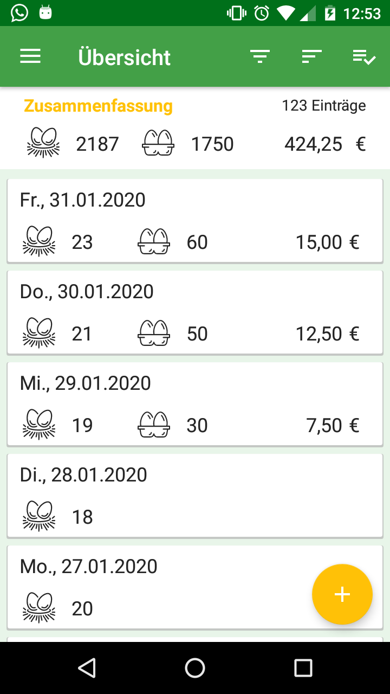
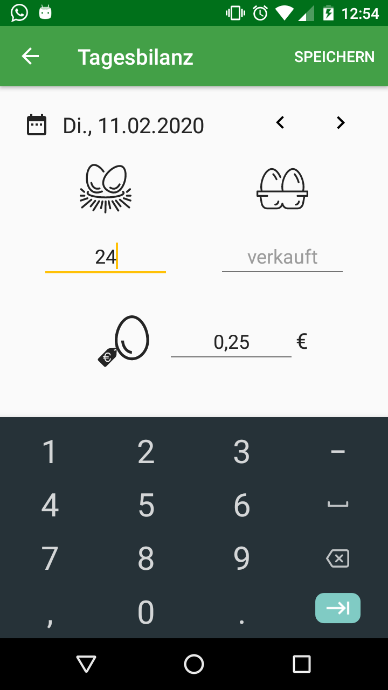
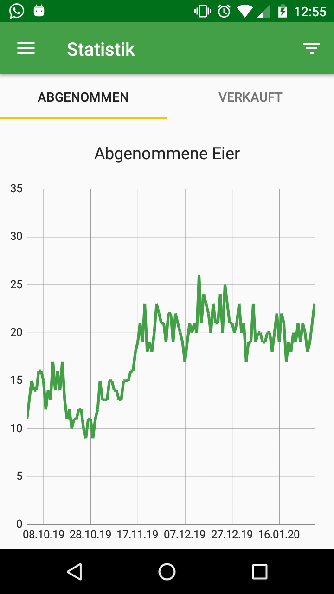
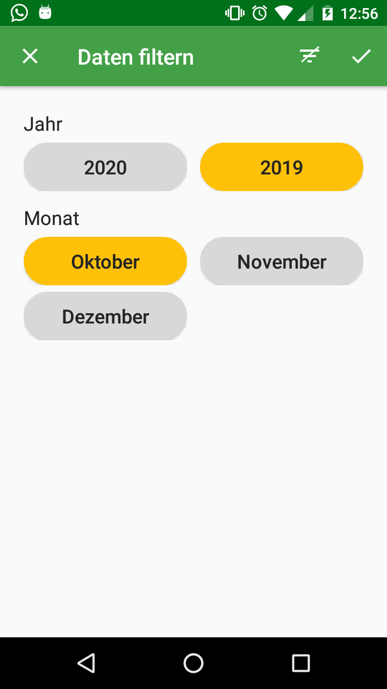
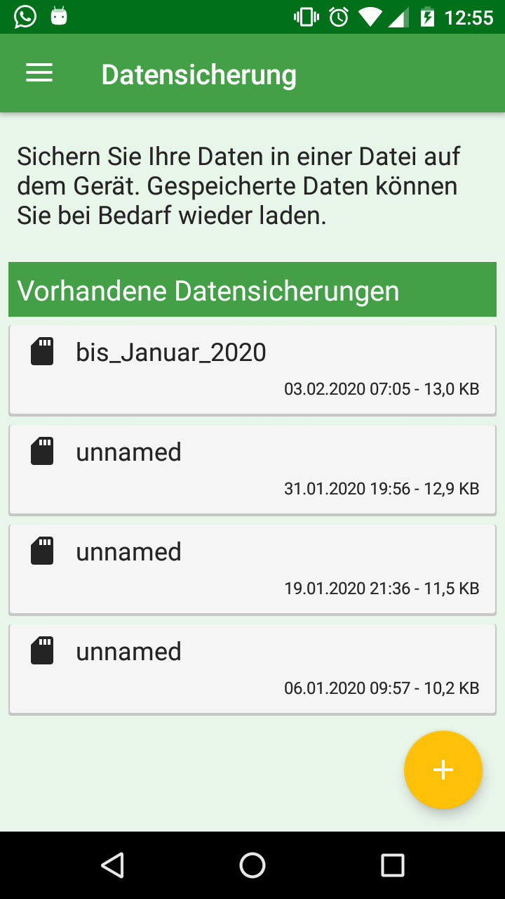

# EggManager
Android App zur Speicherung und Analyse der Daten Ihres Hühnerhofs.
Mit dieser App speichern Sie ganz einfacht die Anzahl der Eier, die Ihre Hüher an einem Tag gelegt haben sowie die Anzahl der Eier die Sie an diesem Tag zu einem bestimmten Preis verkauft haben.
Sie können diese Daten nach Jahren oder Monaten filtern und so sehr einfach ein Übersicht über die Produktivität Ihres Hühnerhofs erhalten.

## Download
Das aktuelle Release v1.0.0 kann [hier](https://github.com/mjferstl/Egg-Manager-Android-App/releases/download/v1.0.0/EggManager_v1_0_0.apk) als APK-Datei heruntergeladen werden.  
Die App können Sie dann auf Ihrem Android-Gerät installieren.

## Screenshots
Behalten Sie den Überblick über Ihre Daten und fügen Sie die täglichen Bilanzen Ihres Hühnerhofs einfach hinzu.

  
  

Sie können die gespeicherten Daten graphisch visualisieren und nach bestimmten Monaten filtern, um Sie genauer zu analysieren.

  
  

Alle eingetragenen Daten können einfach auf dem Gerät im JSON-Format gespeichert werden um sie bei Bedarf wieder zu importieren.

  

## License
[MIT](https://github.com/mjferstl/Egg-Manager-Android-App/blob/master/LICENSE)
